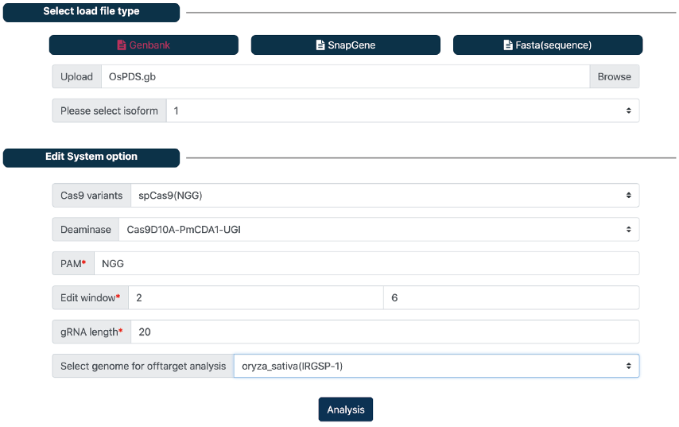
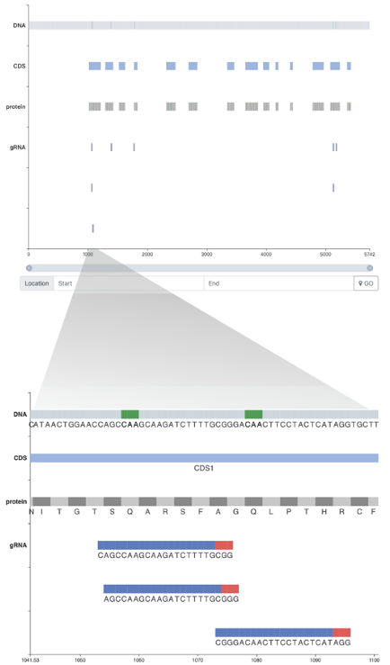

# CRISPR-BETS Desktop version

* CRISPR-BETS (CRISPR-Base Editing To Stop codon) is developed for designing gRNA to knockout gene by CRISPR base editing system. 

* CRISPR-BETS is implemented with both  web (http://bioinfor.yzu.edu.cn/crisprbets/) and desktop version, which are integrated into a user-friendly graphic user interface (GUI) and compatible with major operating systems (Win, MacOS, Linux).

### [Documentation](https://crispr-bets-online.readthedocs.io/en/latest/)

### Video tutorials

[YouTube (EN)]()

[bilibili (中文)]()

